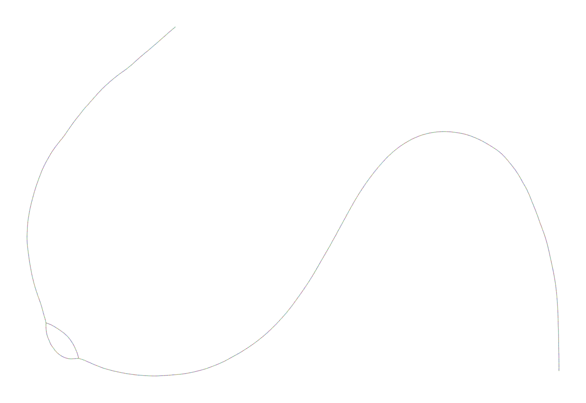
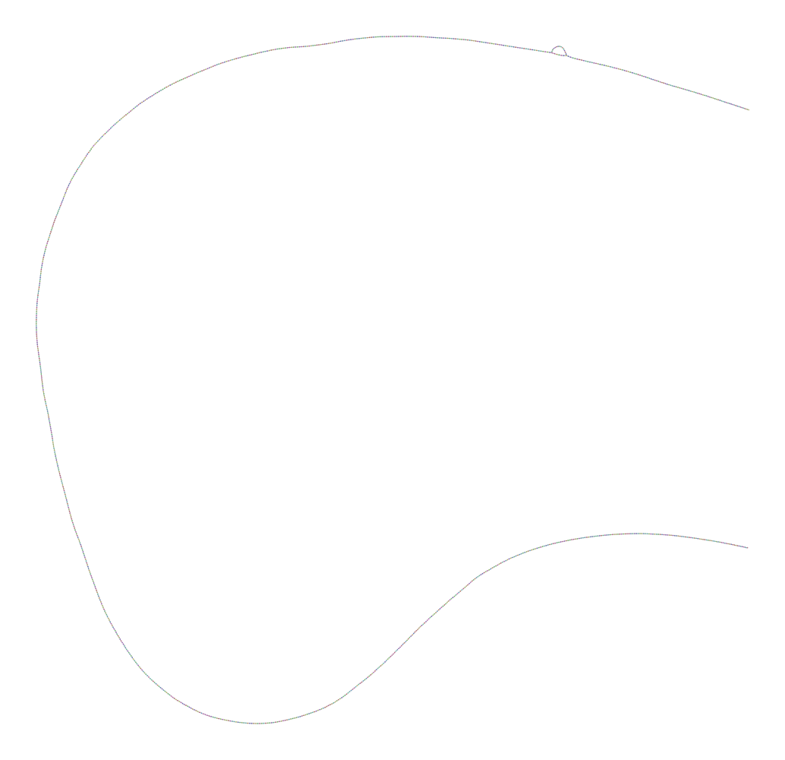
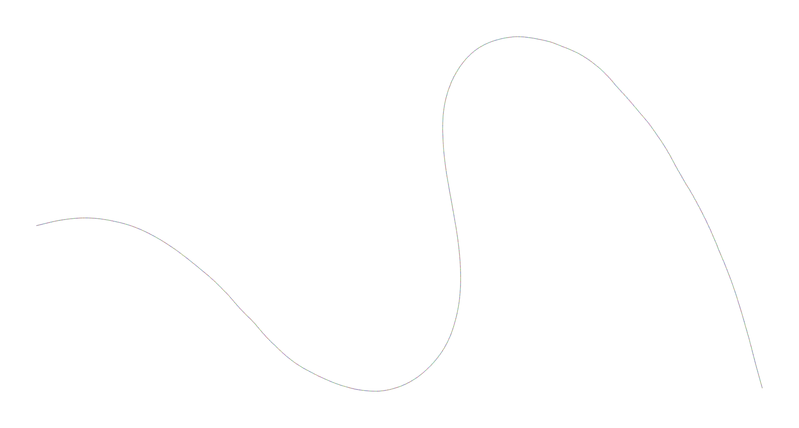

---

# CS249 Assignment 2 Report

## Task 1: Basic genome assembly algorithms

This repository contains implementations and evaluations of two core genome assembly algorithms:

- **De Bruijn Graph (DBG)** assembler
- **Overlap-Layout-Consensus (OLC)** assembler

The algorithms are implemented in the codes dbg.py ( De Bruijn Graph assembler), olc.py (OLC assembler for short reads), and olc_long.py (OLC assembler for long reads)

Usage:

### 🚀 Usage

Below are instructions to run each assembler manually, as well as how to use the provided SLURM scripts for batch processing.

#### 1️⃣ `dbg.py` – De Bruijn Graph Assembler

**Description**: Constructs a de Bruijn graph using k-mers and traverses Eulerian paths to generate contigs.

**Usage**:
```bash
python dbg.py -i <input.fastq> -k <kmer_size> -o <output.fasta> [-c <min_coverage>]
```

Arguments:
-i: Input FASTQ file
-k: K-mer size (e.g., 40)
-o: Output FASTA file
-c: (Optional) Minimum k-mer coverage to keep a node (default: 1)

#### 2️⃣ `olc.py` – OLC Assembler for Short Reads

**Description**: Computes overlaps between reads using Hamming distance and builds an overlap graph to derive contigs.

**Usage**:
```bash
python olc.py -i <input.fastq> -o <output.fasta> -m <min_overlap> -M <max_mismatches> -c <min_contig_len>
```

Arguments:
-i : Input FASTQ file
-o : Output FASTA file
-m : Minimum required overlap length
-M : Maximum number of mismatches allowed in overlap
-c : Minimum contig length to report

#### 3️⃣ `olc_long.py` –  OLC Assembler for Long Reads (ONT)

**Description**: Optimized for long, noisy reads from ONT; uses identity threshold instead of mismatch count.

**Usage**:
```bash
python olc_long.py <input.fastq> <output.fasta> -m <min_overlap> -i <min_identity>
```

Arguments:
<input.fastq> : Input FASTQ file (positional)
<output.fasta> : Output FASTA file (positional)
-m : Minimum overlap length
-i : Minimum identity (e.g., 0.80 = 80%)


### 🚀 Run and evaluate
All assemblies were executed using the provided SLURM scripts: `run_dbg.sh` for the De Bruijn Graph assembler and `run_olc.sh` for both short-read and long-read OLC assemblies. Evaluation of the resulting assemblies was performed using QUAST through the `quast.sh` script. The full set of QUAST output reports is stored in the `quast/quast_results/` directory, while a summary of key evaluation metrics across all assemblies is consolidated in `quast/quast_summary.tsv`.

## Task 1.3: Applications of assembly algorithms

### 1️⃣ Assembly graph exploration of Toy Reads

To explore the assembly graph structure, we used our custom De Bruijn Graph assembler (`dbg.py`) with the toy dataset `reads_b.fastq` and a k-mer size of 40. The assembly graph was output directly in GFA format as part of the implementation. We then visualized this graph using [Bandage](https://rrwick.github.io/Bandage/) with the following command:

```bash
Bandage image reads_b_dbg_k40.gfa reads_b_dbg_k40.png
```

#### 🖼️ Graph Visualization

Below is the resulting assembly graph for `reads_b.fastq`:



#### 🔍 Interpretation

The graph shows a long linear contig with a small bubble near the beginning. This **bubble** indicates a region of ambiguity—often caused by sequencing errors or low-complexity/repeat regions. While the majority of the graph is linear (indicating high confidence in the path), such bubbles are common in real assembly scenarios and can be resolved by incorporating coverage information or applying heuristics to collapse paths.

---

#### 🧠 How This Helps Improve Assembly

Visualizing assembly graphs allows us to:

* Detect structural issues (e.g., bubbles, loops, dead ends)
* Evaluate graph complexity and branching
* Identify optimal `k` values by comparing graph simplicity across runs
* Guide algorithmic improvements (e.g., bubble popping, tip trimming, graph simplification)

This analysis shows that although our assembler can reconstruct linear segments well, incorporating error correction or adjusting `k`-mer filtering thresholds could help resolve ambiguous regions for improved contig quality.

---
### 2️⃣ Assembly quality comparison by k-mer size
To evaluate the impact of k-mer size on assembly performance, we applied our De Bruijn Graph assembler to reads_r.fastq using two different k-mer values: k = 35 and k = 45. The resulting assemblies were evaluated using QUAST and visualized with Bandage to assess contiguity and graph structure. Assemblies and graphs are in `results/out_dbg`

The QUAST evaluation metrics revealed notable differences. The assembly with k = 35 produced 2 contigs with a total length of 9,972 bp and achieved a genome fraction of 99.23%, indicating nearly complete coverage of the reference genome. In contrast, the assembly with k = 45 resulted in a single contig of 9,720 bp, covering 97.43% of the genome. QUAST evaluations are summarized and compared in `quast/quast_summary.tsv`.

Graph visualization using Bandage highlighted further contrasts. The k = 35 graph exhibited a more tangled structure, including a small loop, likely due to ambiguous overlaps or repeat regions that were not fully resolved. This complexity stems from the lower k-mer size, which increases overlap sensitivity but also introduces more connections in the graph. On the other hand, the k = 45 assembly graph was clean and linear, indicating higher specificity in overlaps and a more streamlined assembly graph.

Assembly graph for `reads_r.fastq` with k-mer size of 35:



Assembly graph for `reads_r.fastq` with k-mer size of 45:



The observed differences can be explained by the trade-off between k-mer size and assembly performance. Smaller k-mers (e.g., k = 35) improve sensitivity and are more forgiving in cases of low coverage, but they can introduce ambiguities in repetitive regions. Larger k-mers (e.g., k = 45) provide greater specificity and cleaner graph topologies, but they require higher coverage and may miss regions with insufficient overlap support.

### 3️⃣ Comparative Assembly of MERS Virus Reads
To evaluate the robustness and performance of our assembly algorithms under realistic conditions, we assembled MERS virus reads using both the De Bruijn Graph (DBG) and Overlap-Layout-Consensus (OLC) implementations. Four datasets were processed:

HiSeq reads (error-free): no_error_reads_hiseq_5k.fastq
HiSeq reads (with errors): reads_hiseq_5k.fastq
ONT reads (error-free): no_error_ont_hq_50x.fastq
ONT reads (with errors): ont_hq_50x.fastq

All resulting assemblies were evaluated using QUAST against the MERS reference genome. QUAST evaluations are summarized and compared in `quast/quast_summary.tsv`.

#### 🔍 Analysis

- **Error-Free Assemblies**:
  - Both DBG and OLC produced highly contiguous and accurate assemblies with near-complete genome coverage.
  - No mismatches or misassemblies were reported.
  - OLC consistently resulted in fewer contigs, especially for long reads, due to its global overlap strategy.

- **Error-Prone Reads**:
  - Performance degraded in both algorithms when sequencing errors were introduced.
  - OLC proved more resilient, generating fewer contigs and achieving higher N50 values compared to DBG.
  - This resilience is due to OLC’s reliance on full-read overlaps, which can better tolerate small sequencing variations.

- **ONT vs. HiSeq**:
  - Errors had a more severe impact on ONT reads, particularly affecting DBG performance.
  - DBG showed increased fragmentation due to its sensitivity to base-level inaccuracies.
  - OLC handled ONT errors more gracefully, although a slight rise in indel rates was observed.

#### 🧠 Conclusion

The OLC algorithm outperformed DBG when dealing with error-containing reads, especially in long-read datasets (ONT). While DBG was faster and simpler for high-quality short reads, it suffered in the presence of noise. This underscores the importance of selecting the appropriate algorithm based on read quality and type.

### 4️⃣ Comparison with Existing Assemblers (SPAdes and Flye)

To evaluate the performance of our custom assemblers, we ran **SPAdes** on the HiSeq datasets and **Flye** on the ONT datasets, standard tools for short-read and long-read assemblies, respectively. Both tools were run on the same synthetic MERS virus datasets, and their output contigs were evaluated with QUAST using the reference genome. QUAST evaluations are summarized and compared in `quast/quast_summary_spades_flye.tsv`.

#### 🔍 Analysis

- **SPAdes** performed consistently well on both error-free and error-containing Illumina reads, producing a single contig with 97.89% genome coverage and perfect sequence accuracy.
- **Flye** also produced single-contig assemblies for both error-free and error-containing ONT reads. While it achieved slightly lower genome fraction (97.68–97.71%) than SPAdes, it still maintained excellent continuity. As expected, the error-containing ONT input showed increased mismatches and indels.
- Both tools outperformed our custom implementations in terms of continuity, accuracy, and robustness to sequencing errors.

For this analysis **multiple attempts to run Canu on the synthetic ONT datasets failed**, even after adjusting memory, grid, and correction settings. The failures were due to segmentation faults in the `falconsense` module and crashes during read partitioning, which are known issues with small datasets and development versions of Canu. As a result, **Flye was used as a reliable alternative**, completing all assemblies without issue.

## Task 2: Lizard assembly
For the assembly of the *Scincus mitranus* (sandfish lizard) genome, I selected **Hifiasm**, a state-of-the-art assembler specifically optimized for **high-fidelity (HiFi) long reads**, such as those produced by PacBio Sequel II and Revio platforms. 

Hifiasm offers several key advantages:
- It is designed to **fully exploit the high accuracy and long range** of HiFi reads, producing assemblies with **exceptional contiguity and low error rates**.
- It natively supports **haplotype-resolved assembly**, which is important for diploid genomes like that of the sandfish lizard.
- Hifiasm integrates well with **Hi-C data**, enabling chromosome-level scaffolding directly within the assembly pipeline.
- It is highly efficient and scalable, making it well-suited for complex eukaryotic genomes.

The assembly was run using both **HiFi long reads** and **Hi-C sequencing data**. The resulting files are stored in the IBEX directory `/ibex/scratch/projects/c2014/alelopezv/2502_Algorithms/Algorithms-for-Bioinformatics/02_assignment/results/hifiasm`. Among the multiple outputs generated by Hifiasm, the primary file for evaluation is: `lizard_asm_hic.hic.p_ctg.gfa`. This file represents the **primary contigs** (`p_ctg`) of the haploid genome assembly, incorporating the Hi-C phasing information (`hic`) and includes sequences in GFA format. For downstream evaluations such as QUAST, BUSCO, and Merqury, this file was converted to a FASTA file using the following command 

`gfatools gfa2fa $ASSEMBLY_GFA > $ASSEMBLY_FASTA`

The entire workflow for the evaluation is in the file `scripts/evaluate_lizard_assembly.sh` and the results are in `/ibex/scratch/projects/c2014/alelopezv/2502_Algorithms/Algorithms-for-Bioinformatics/02_assignment/results/hifiasm_evaluation` in the subfolder `quast`, `busco`, `merqury`, and `flagger`.


## Task 2.2: Assembly evaluation
### 1️⃣ Basic metrics

| Metric                           | Value         |
|----------------------------------|---------------|
| # Contigs                        | 83            |
| Largest Contig (bp)             | 341,986,872   |
| Total Assembly Length (bp)      | 1,806,337,024 |
| GC Content (%)                  | 45.47         |
| N50 (bp)                         | 138,412,276   |
| N90 (bp)                         | 40,490,265    |
| auN                              | 176,140,161.9 |
| L50                              | 4             |
| L90                              | 12            |
| # N's per 100 kbp                | 0.00          |

The Hifiasm-based assembly yielded a highly contiguous and complete genome, as reflected by strong QUAST metrics. The assembly consists of only 83 contigs, with a total length of ~1.81 Gb, matching expectations for reptilian genomes. The largest contig exceeds 341 Mb, and the N50 is 138.4 Mb, indicating chromosome-scale contiguity. With an L50 of just 4 contigs, the assembly demonstrates that half the genome is represented by four large scaffolds, further highlighting its quality. The absence of ambiguous bases (0.00 N's per 100 kbp) and a GC content of 45.47% suggest clean, high-fidelity sequence data.

### 2️⃣ Gene completeness

### 3️⃣ K-mer distribution and QV score

### 4️⃣ Mis-assemblies


hifiasm results: `/ibex/scratch/projects/c2014/alelopezv/2502_Algorithms/Algorithms-for-Bioinformatics/02_assignment/results/hifiasm`

verkko results: `/ibex/scratch/projects/c2014/alelopezv/2502_Algorithms/Algorithms-for-Bioinformatics/02_assignment/scripts/lizard_verkko_run`

evaluation: `/ibex/scratch/projects/c2014/alelopezv/2502_Algorithms/Algorithms-for-Bioinformatics/02_assignment/results/hifiasm_evaluation`
