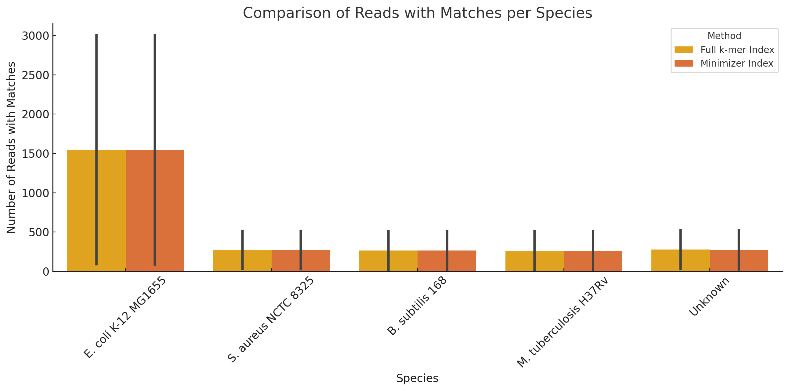

---

# CS249 Assignment 1 Report

## Task 1: Metagenome Classification by String Matching

In string matching, the **text** is usually the longer sequence or data structure that you search within. It contains potential substrates where patterns may be found. **Patterns** are the shorter sequences that you are looking for within the text. They are the sequences you aim to match or identify within the larger text.

In this scenario where I am classifying sequencing reads against reference genomes:
- The reference genomes act as the text. These are the longer sequences in which I am trying to find matches, as shown in the Genome size of the following table.
- The sequencing reads are the patterns. These are the shorter sequences I attempt to find within the reference genomes to determine the origin or closest matches of these reads in the known genomic sequences.

### Reference and Read Sizes

| Species                    | Genome Size (bp) |
|---------------------------|------------------|
| *E. coli* K-12 MG1655     | 4,641,652        |
| *B. subtilis* 168         | 4,215,606        |
| *P. aeruginosa* PAO1      | 6,264,404        |
| *S. aureus* NCTC 8325     | 2,821,361        |
| *M. tuberculosis* H37Rv   | 4,411,532        |

| Read File                             | Read Size (bp)   |
|--------------------------------------|------------|
| simulated_reads_miseq_10k_R1.fastq.gz  | 3,114,900  |
| simulated_reads_miseq_10k_R2.fastq.gz  | 3,114,900  |
| simulated_reads_no_errors_10k_R1.fastq.gz | 1,354,900  |
| simulated_reads_no_errors_10k_R2.fastq.gz | 1,354,900  |

---

### Task 1.1: Multiple Matches
*Consider that we want to classify an entire collection of reads, where many organisms may share identical sequences in their genomes. Develop and justify a strategy for handling reads that match multiple organisms. Your answer should consider both biological reality and computational efficiency.*

**Strategy:**
For this task, the Aho-Corasick algorithm will be implemented, which is an efficient multiple pattern matching technique that will search for reads within a trie constructed from the reference genomes. This algorithm is ideal for this purpose because it can handle multiple matches efficiently and scales well with the number of patterns.
A trie will be implemented (via the Aho-Corasick automaton) where each node represents a k-mer from the reference genomes, and each edge denotes a possible continuation of that k-mer. This structure allows us to quickly traverse and match entire reads against potential genomic sources.
When a read matches multiple genomes, I will record all matches. This approach respects the biological reality that a read might come from any of the matching organisms, especially in complex samples like soil or stool that contain numerous similar or closely related species.

---

### Task 1.2: Exact Matching (k=31)

#### Classification Results

| Reads        | E. coli | S. aureus | B. subtilis | M. tuberculosis | P. aeruginosa |
|--------------|---------|-----------|-------------|------------------|----------------|
| no_errors_R1 | 3002    | 509       | 507         | 504              | 518            |
| no_errors_R2 | 106     | 31        | 29          | 21               | 50             |
| miseq_R1     | 3004    | 515       | 512         | 512              | 524            |
| miseq_R2     | 91      | 29        | 18          | 12               | 28             |

#### Runtime and Memory Usage

| Reads        | Time (s) | Memory (MB) |
|--------------|----------|-------------|
| no_errors_R1 | 275.94   | 27525.48    |
| no_errors_R2 | 367.82   | 27502.35    |
| miseq_R1     | 332.97   | 27524.41    |
| miseq_R2     | 269.05   | 27525.90    |

---

### Task 1.3: Approximate Matching (1 mismatch allowed)

#### Classification Results
| Reads        | E. coli | S. aureus | B. subtilis | M. tuberculosis | P. aeruginosa |
|--------------|---------|-----------|-------------|------------------|----------------|
| no_errors_R1 | 3009    | 518       | 511         | 509              | 537            |
| no_errors_R2 | 106     | 31        | 29          | 21               | 50             |
| miseq_R1     | 3005    | 524       | 523         | 518              | 545            |
| miseq_R2     | 137     | 52        | 35          | 25               | 68             |

#### Runtime and Memory Usage
| Reads        | Time (s) | Memory (MB) |
|--------------|----------|-------------|
| no_errors_R1 | 370.80   | 27475.06    |
| no_errors_R2 | 285.64   | 27475.17    |
| miseq_R1     | 388.72   | 27475.04    |
| miseq_R2     | 339.49   | 27491.49    |

---

### Task 1.4: Comparison with BLASTN
#### Classification Results
| Reads        | E. coli | S. aureus | B. subtilis | M. tuberculosis | P. aeruginosa |
|--------------|---------|-----------|-------------|------------------|----------------|
| no_errors_R1 | 3547    | 541       | 555         | 650              | 526            |
| no_errors_R2 | 3508    | 550       | 563         | 587              | 522            |
| miseq_R1     | 1680    | 208       | 177         | 185              | 172            |
| miseq_R2     | 610     | 60        | 84          | 42               | 52             |

> **Performance:** BLAST took 43 seconds and 224.79 MB, showing its heuristic nature compared to Aho-Corasick’s exhaustive matching.
Aho-Corasick performs exhaustive string matching and returns all potential matches (with or without mismatches), while BLAST uses a heuristic approach based on alignment scoring and statistical filtering. According to the original BLAST paper (Altschul et al., 1990), the goal is to report high-scoring segment pairs that are likely to be biologically significant. This filtering reduces the number of reported matches compared to exact or approximate pattern matching tools like Aho-Corasick.
---

## Task 2: k-mer Indexing for Classification

### Task 2.1: Build the k-mer Index

The chosen data structure for storing k-mers is a defaultdict of lists from Python's collections module. This structure was selected for its efficiency and ease of use. The defaultdict simplifies code management by automatically handling missing keys with a default value, which in this case is an empty list. This is particularly useful for dynamically adding k-mers to the index as they are discovered in the genome sequences. Lists are used to store occurrences of each k-mer across different genomes, allowing for easy appending of new occurrences without the overhead of checking if the key already exists. This setup optimizes the time complexity of both insertion and lookup operations, which are critical in genomic applications where the dataset can be extensive and complex. The combination of defaultdict and lists ensures that operations remain O(1) on average, offering both time efficiency and straightforward access patterns.

The theoretical number of different k-mers of length 31 can be calculated assuming each position can be one of four nucleotides (A, C, G, T).

- **Data structure:** A `defaultdict(list)` was used to map each 31-mer to its source genomes.
- **Unique 31-mers Indexed:** 22,104,695
- **Theoretical 31-mers:** 4,611,686,018,427,387,904 (4⁻³¹)

> **Discrepancy Explanation:** The discrepancy between the actual and theoretical number of k-mers of length 31 is influenced by several factors. First, the limited size of genome sequences means not all possible k-mer combinations can be represented, as genomic lengths are often much shorter than the combinations generated by 431. Additionally, the prevalence of repetitive DNA within genomes reduces the diversity of unique k-mers. Biological constraints also skew the distribution, as certain sequences are more common due to evolutionary pressures, leading to a non-uniform k-mer presence.
The quality and completeness of genome assembly significantly impact k-mer diversity. Incomplete or low-quality assemblies may miss or misrepresent genomic regions, affecting the accuracy of k-mer indexing. This is particularly problematic in complex or highly repetitive areas, which might be underrepresented in the k-mer index. Understanding these limitations is crucial for interpreting genomic data and improving genomic analysis methodologies, providing insights into the nature of genomic information and the factors that influence its study.

---

### Task 2.2: Classify with Full k-mer Index

- Reads were classified by searching for exact matches of k-mers in the index.
- We counted both the number of matching reads and total number of matched k-mers.

| Reads File                             | Species                  | Reads with Matches | Total k-mer Matches |
|----------------------------------------|---------------------------|---------------------|----------------------|
| simulated_reads_miseq_10k_R1.fastq.gz  | B. subtilis 168           | 512                 | 121777               |
|                                        | E. coli K-12 MG1655       | 3004                | 698228               |
|                                        | M. tuberculosis H37Rv     | 512                 | 114197               |
|                                        | P. aeruginosa PAO1        | 524                 | 111627               |
|                                        | S. aureus NCTC 8325       | 515                 | 116634               |
| simulated_reads_miseq_10k_R2.fastq.gz  | B. subtilis 168           | 21                  | 2062                 |
|                                        | E. coli K-12 MG1655       | 95                  | 27106                |
|                                        | M. tuberculosis H37Rv     | 15                  | 5342                 |
|                                        | P. aeruginosa PAO1        | 35                  | 2901                 |
|                                        | S. aureus NCTC 8325       | 39                  | 6626                 |
| simulated_reads_no_errors_10k_R1.fastq.gz | B. subtilis 168        | 507                 | 52455                |
|                                        | E. coli K-12 MG1655       | 3002                | 305202               |
|                                        | M. tuberculosis H37Rv     | 504                 | 52312                |
|                                        | P. aeruginosa PAO1        | 518                 | 49280                |
|                                        | S. aureus NCTC 8325       | 509                 | 49769                |
| simulated_reads_no_errors_10k_R2.fastq.gz | B. subtilis 168        | 18                  | 1224                 |
|                                        | E. coli K-12 MG1655       | 91                  | 16844                |
|                                        | M. tuberculosis H37Rv     | 12                  | 3371                 |
|                                        | P. aeruginosa PAO1        | 28                  | 1877                 |
|                                        | S. aureus NCTC 8325       | 29                  | 2041                 |

Matching reads: This counts how many reads have at least one matching k-mer per organism. It provides an insight into how many reads are likely derived from each referenced genome.

Total k-mer matches: This involves counting all occurrences of matching k-mers per organism, giving a deeper insight into the genomic representation within the sample.

> **Discrepencies:** In our comparison of k-mer indexing and approximate string matching methods, the results reveal that string matching consistently yields higher counts of matching reads. This discrepancy can be attributed to the inherent flexibility of string matching techniques, which tolerate minor mismatches, insertions, or deletions within the sequences. Unlike the exact k-mer matching, which rigidly requires a perfect match of 31-base sequences to the reference k-mers, string matching accommodates slight deviations from the reference genome. This adaptability is crucial when analyzing reads that may contain sequencing errors or exhibit natural genetic variations. Therefore, string matching provides a broader and more inclusive identification of matches, capturing a wider array of potentially relevant genetic material that exact k-mer matching might overlook due to its stringent matching criteria

> **Multiple Matches Handling:** In cases where a k-mer matches multiple regions within the same genome, the approach has been to record each match occurrence. This method acknowledges the biological reality that genomes contain repetitive elements or highly conserved regions where identical k-mers might appear multiple times. By counting each occurrence of a k-mer match, the analysis reflects the genomic complexity more accurately. This is important in understanding the functional and structural roles these repetitive or conserved k-mers play within the genome.
Handling multiple k-mer matches in this way also enhances the robustness of the genomic analysis. It allows for a detailed view of which areas of the genome are most represented in the reads, providing insights that could be pivotal for studies focused on gene expression, genome structure, or evolutionary biology.

---

### Task 2.3: Classification with Minimizers

To improve memory efficiency, we implemented a minimizer-based indexing scheme (using w=10) and compared its performance.

| Reads File                             | Species                  | Reads with Matches | Total k-mer Matches |
|----------------------------------------|---------------------------|---------------------|----------------------|
| simulated_reads_miseq_10k_R1.fastq.gz  | _B. subtilis 168 _          | 509                 | 22609                |
|                                        | E. coli K-12 MG1655       | 3003                | 132745               |
|                                        | M. tuberculosis H37Rv     | 512                 | 21089                |
|                                        | P. aeruginosa PAO1        | 522                 | 21460                |
|                                        | S. aureus NCTC 8325       | 514                 | 22626                |
| simulated_reads_miseq_10k_R2.fastq.gz  | B. subtilis 168           | 19                  | 264                  |
|                                        | E. coli K-12 MG1655       | 92                  | 1952                 |
|                                        | M. tuberculosis H37Rv     | 11                  | 225                  |
|                                        | P. aeruginosa PAO1        | 30                  | 205                  |
|                                        | S. aureus NCTC 8325       | 37                  | 724                  |
| simulated_reads_no_errors_10k_R1.fastq.gz | B. subtilis 168        | 507                 | 9585                 |
|                                        | E. coli K-12 MG1655       | 3002                | 55686                |
|                                        | M. tuberculosis H37Rv     | 504                 | 9002                 |
|                                        | P. aeruginosa PAO1        | 516                 | 8988                 |
|                                        | S. aureus NCTC 8325       | 509                 | 9312                 |
| simulated_reads_no_errors_10k_R2.fastq.gz | B. subtilis 168        | 17                  | 122                  |
|                                        | E. coli K-12 MG1655       | 87                  | 1179                 |
|                                        | M. tuberculosis H37Rv     | 11                  | 127                  |
|                                        | P. aeruginosa PAO1        | 25                  | 165                  |
|                                        | S. aureus NCTC 8325       | 27                  | 211                  |

| Method             | Memory Usage (MB) |
|--------------------|-------------------|
| Full k-mer Index   | 4448.64           |
| Minimizer Index    | 975.05            |

> **Memory Reduced by ~78%**  
> Here is the bar plot comparing the number of reads with k-mer matches per species between the full k-mer index and the minimizer-based index methods.
This visual helps illustrate that both methods yield similar read counts across species, despite the significant memory reduction — from 4448.64 MB down to 975.05 MB (a ~78% decrease).

---

## Summary

This assignment explored and compared multiple methods for metagenome classification, including:
- Trie-based exact and approximate matching (Aho-Corasick)
- Heuristic alignment (BLAST)
- Full k-mer indexing and minimizer-based indexing

The analysis revealed trade-offs between sensitivity, runtime, and memory consumption across methods, highlighting how data structures and sketching techniques play critical roles in scalable bioinformatics.

---
